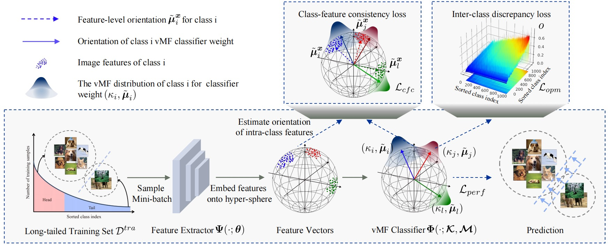

# This is the official implementation  for our paper "Towards Calibrated Hyper-Sphere Representation via Distribution Overlap Coefficient for Long-Tailed Learning" (ECCV 2022 oral)

## TODO
- [2022/08/23] We will update code about loss_cfc mentioned in the paper and experimental environment configuration at this weekend. At next week, we will update some code comments to help you understand how we implemented the formulas in the paper.

## News
- [2022/08/22] We release our camera ready paper to [Arxiv](https://arxiv.org/abs/2208.10043)
- [2022/08/21] We release the code for Image Classification task on ImageNet-LT dataset. Recently, we further improve the performance of our method. Now, you can achieve about overall 54.5% accuracy via using 'vmf_classifier + icd loss', about 1.0% higher than result published in our camera ready paper.

## Quick Start

### Install

### Data Preparation

### Train and Test

1. Train and test on ImageNet-LT

